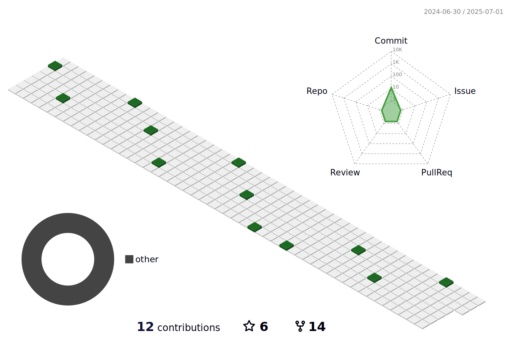

  

  

<!--

  <h4 align="center">📌 슬로건 📌   
  <h6>1️⃣ 꾸준히, 급하지 않게! </h6> 
  <h6>2️⃣ 경청하고, 최대한 공감하면서!</h6>
  <h6>3️⃣ 존중하고, 배려하면서!</h6> 

 -->

<!--  

  
   

 -->

<h4 align="center">
  
 
:cloud: About me :cloud:  
  
   

<!--  
 -->

   

🛠 Stack 🛠
 
   

  

  

 

    🧮 Tier 🧮    
     

 

  
  
  

  <h4 align="center">  📽 Activity 📽     

 
  
 

| 기간 | 프로젝트/동아리 이름|
| :---: | :---: | 
| 2021.03 ~ 2021.11 | 멋쟁이 사자처럼 동아리 개설 및 운영진 |
| 2021.03 ~ 2021.12 | 스마트 쇼핑 카트 + 쓰쇼 앱 프로젝트 진행 |
| 2021.09 ~ 2021.09 | 멋쟁이 사자처럼 연합 해커톤 참여 |
| 2021.10 ~ 진행중 | 개발자 배씨 블로그 운영 |
| 2022.04 ~ 2022.04 | FamilyStory 프로젝트 진행 |
| 2022.05 ~ 2022.05 | StudyWithUs 프로젝트 진행 |
| 2022.06 ~ 2022.06 | 물어바 프로젝트 진행 |
| 2022.07 ~ 진행 중 | SSAFY 8 기 과정 진행 중 (서울 캠퍼스) |
| 2023.01 ~ 2023.02 | 바꾸바꾸 프로젝트 진행 |
| 2023.02 ~ 2023.04 | VODA 프로젝트 진행 |
| 2023.04 ~ 2023.05 | HelloWorld 프로젝트 진행 |

 

   

  

   

  
  
  
<!--     
   

  
   -->

